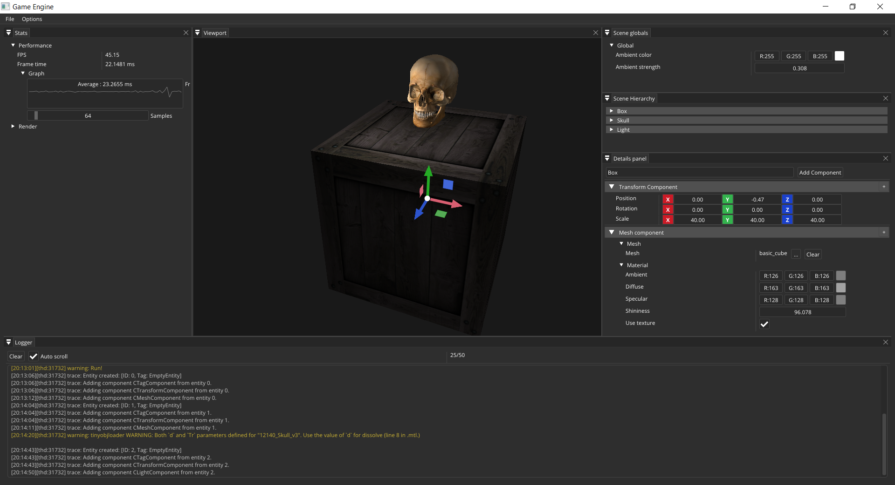

# GameEngine
A basic engine which I use to practise C++, learn about some libraries (as OpenGL, Imgui...) and try several architecture designs. 
Please if you dive in the code and find out bugs or whatever that can be improved, let my know in the [Issues page](https://github.com/sergiodrm/GameEngine/issues).

## Features
- **Render**: the engine uses several classes to abstract its source code from the render API. Thus, if I would like to use another render API, I only have to implement the classes which use the API directly. Right now, the engine uses OpenGL as render API.
- **UI**: nowadays there is no _runtime UI_ like health bar or in-game menus. However, **imgui** is integrated in the system to support basic UI functionality. With this library, I made a basic *Editor* with dockable panels like *Scene hierarchy panel* or *Details panel* to show the entities in the scene and their properties.
- **ECS**: a basic custom **Entity Component System** is implemented in the engine. An entity is the basic object that can be placed in a scene. Every entity is filled with components, the classes which give functionality to the them. When an entity is created, a `TransformComponent` and `TagComponent` are attached to it by default. Currently those are the components implemented:
  - `CameraComponent`: to use the entity as camera.
  - `NativeScriptComponent`: a behavior script can be added to the entity.
  - `SpriteRenderComponent`: a basic quad with a texture that can be changed from the editor.
  - `MeshComponent`: a 3D mesh loaded from a file that can be changed from the editor.
  - `LightComponent`: basic point light with color properties.
  - `TransformComponent`: component which has the position, orientation and scale of the entity.
  - `TagComponent`: component which has the name of the entity.

## Next updates
- A lot of bug fixing.
- CMake to build the code.
- Directional lights.
- Asset Manager.
- Content browser.
- Shadows rendering.
- Loading files in a background thread.
- Integrate Lua as scripting language.
- Separate editor scene from runtime scene.
- Save/load scenes.
